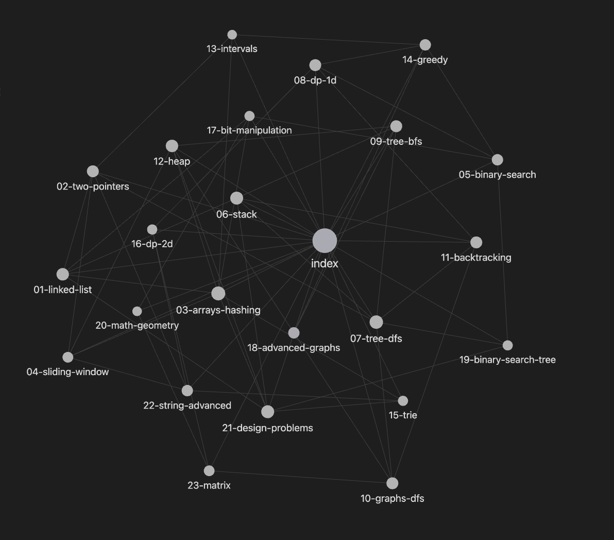

# DSA Learning Hub

A comprehensive, pattern-based approach to mastering Data Structures and Algorithms. This vault contains **23 algorithmic patterns** and **118+ problems** designed to help you recognize and apply reusable problem-solving techniques.

> **Learning patterns > solving random problems** — Most DSA problems are variations of a small set of patterns. Master the patterns, and you can solve any problem.

## Preview



*The Obsidian graph view shows how all 23 DSA patterns connect to each other. Each node is a topic, and edges show relationships (e.g., "binary search" connects to "BST", "LRU cache" uses both "linked list" and "hash map").*

## Why This Approach?

Blindly grinding LeetCode problems is inefficient. You might solve 100 problems but still struggle on the 101st because you didn't recognize the underlying pattern.

This vault organizes problems by **pattern**, not difficulty or topic. Each pattern includes:
- **Core concepts** explained intuitively
- **Common patterns** with code examples
- **Practice problems** to reinforce learning
- **Related topics** for connecting ideas

## Project Structure

```
.
├── index.md                    # Main navigation hub
├── 01-linked-list/             # Linked List patterns
├── 02-two-pointers/            # Two Pointers technique
├── 03-arrays-hashing/          # Arrays & Hash Maps
├── 04-sliding-window/          # Sliding Window pattern
├── 05-binary-search/           # Binary Search variants
├── 06-stack/                   # Stack patterns
├── 07-tree-dfs/                # Tree DFS traversals
├── 08-dp-1d/                   # 1D Dynamic Programming
├── 09-tree-bfs/                # Tree BFS (level-order)
├── 10-graphs-dfs/              # Graph DFS
├── 11-backtracking/            # Backtracking & recursion
├── 12-heap/                    # Heap & Priority Queue
├── 13-intervals/               # Interval problems
├── 14-greedy/                  # Greedy algorithms
├── 15-trie/                    # Trie (Prefix Tree)
├── 16-dp-2d/                   # 2D Dynamic Programming
├── 17-bit-manipulation/        # Bit manipulation tricks
├── 18-advanced-graphs/         # Graph algorithms (Dijkstra, MST, etc.)
├── 19-bst/                     # Binary Search Trees
├── 20-math-geometry/           # Math & Geometry problems
├── 21-design/                  # System design problems (LRU, LFU, etc.)
├── 22-string-advanced/         # Advanced string techniques
└── 23-matrix/                  # Matrix operations
```

## How to Use This Vault

### For Obsidian Users (Recommended)

This vault is designed for **Obsidian** — a powerful note-taking app with graph visualization.

**Setup:**
1. [Download Obsidian](https://obsidian.md) (free, cross-platform)
2. Clone this repo: `git clone https://github.com/lohitcode/DSA.git`
3. Open Obsidian → "Open folder as vault" → Select the cloned folder

**View the Graph:**
1. Click the **Graph View** icon in the left sidebar (or press `Ctrl+G` / `Cmd+G`)
2. You'll see all 23 patterns connected — zoom in/out to explore
3. Click any node to open that pattern's note
4. Hover over nodes to see connections

**Navigate:**
- Start with **`index.md`** — your main hub listing all patterns
- Click any wikilink `[[like this]]` to jump between topics
- Use the **backlinks** panel to see what links to the current note
- Enable **Graph Analysis** to see orphaned notes or highly connected topics

### Recommended Learning Path

| Stage | Patterns | Focus |
|-------|----------|-------|
| **Foundation** | 01-06 | Basic data structures & two pointers |
| **Trees & Graphs** | 07-11 | DFS, BFS, and traversal techniques |
| **Advanced DS** | 12-17 | Heaps, Tries, DP, and bit manipulation |
| **Expert Level** | 18-23 | Advanced graphs, math, and system design |

### For Each Pattern

1. **Read the pattern file** — understand the core idea
2. **Study the examples** — trace through the code mentally
3. **Solve the problems** — try without looking at solutions
4. **Review related topics** — connect to other patterns

## Running the Code

Each problem folder contains:
- `solution.go` — Reference implementation
- `solution_test.go` — Test cases
- `_hints.txt` — Hints if you're stuck

```bash
# Run tests for a specific problem
cd 03-arrays-hashing/problems/001-two-sum/
go test -v

# Run all tests in a pattern folder
cd 03-arrays-hashing/
go test ./...
```

## Key Features

### Visual Learning
- ASCII diagrams for data structures
- Step-by-step algorithm walkthroughs
- Complexity analysis explained intuitively

### Pattern Recognition
- Each pattern explains **when to use it**
- Common pitfalls and how to avoid them
- "Pro tips" from practical experience

### Interconnected Knowledge
- Wikilinks connect related patterns
- Graph view shows relationships between topics
- Builds mental models, not just memorization

## Progress Tracking

- **23 Patterns** — Each a reusable problem-solving technique
- **118+ Problems** — Carefully selected to reinforce patterns
- **1 Goal** — Build intuition, not just memorize solutions

## Contributing

Feel free to:
- Add more problems to existing patterns
- Suggest new patterns you've discovered
- Improve explanations or add diagrams
- Fix bugs or optimize solutions

## Acknowledgments

Inspired by the pattern-based teaching methodology from NeetCode and Grokking the Coding Interview.

---

**Happy Learning!** Remember: The goal isn't to memorize solutions — it's to recognize patterns and apply them to new problems.
